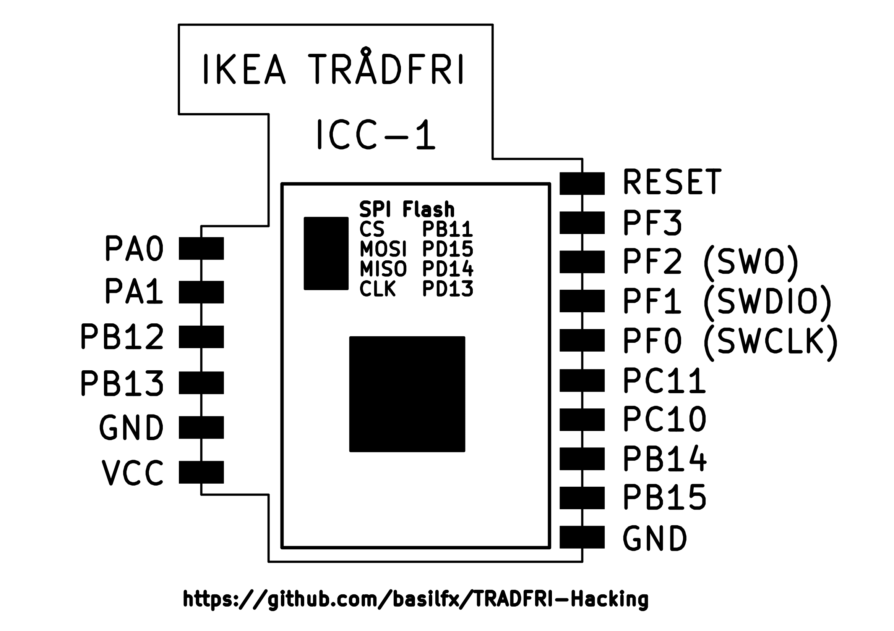
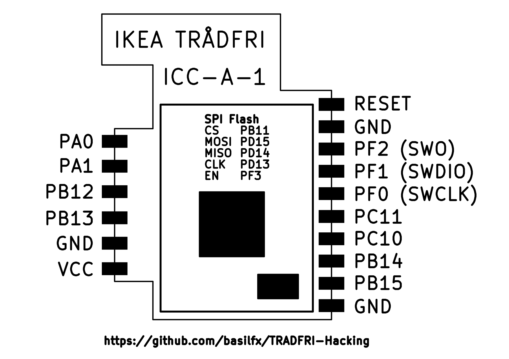
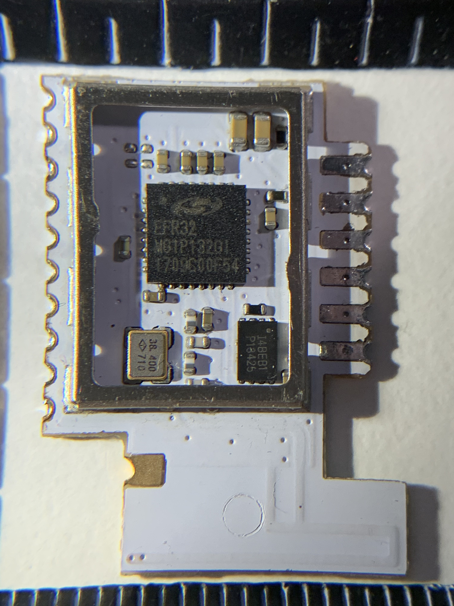
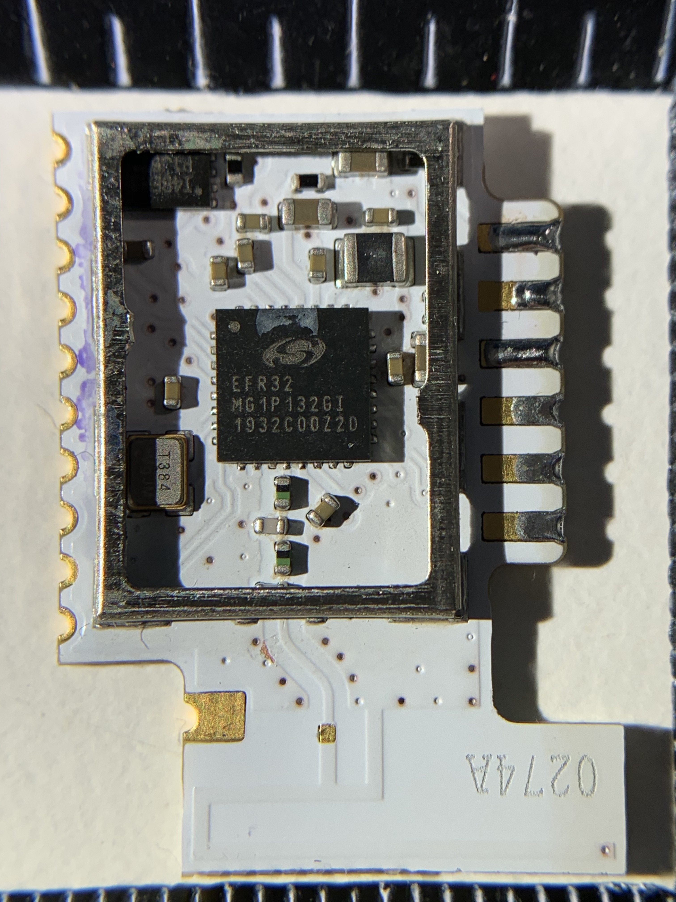
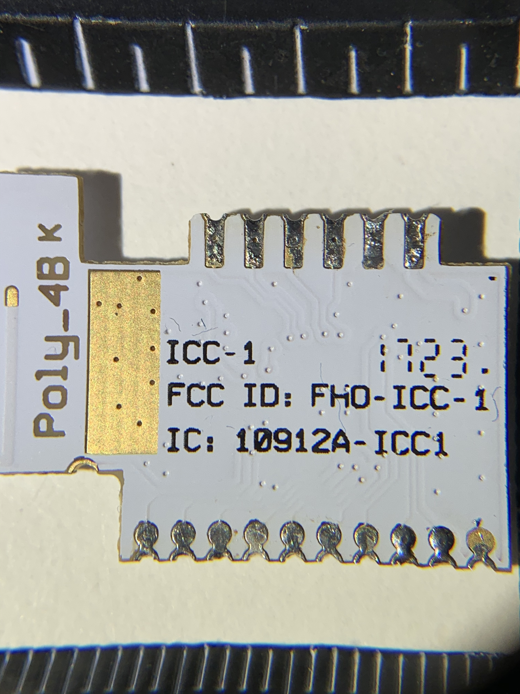
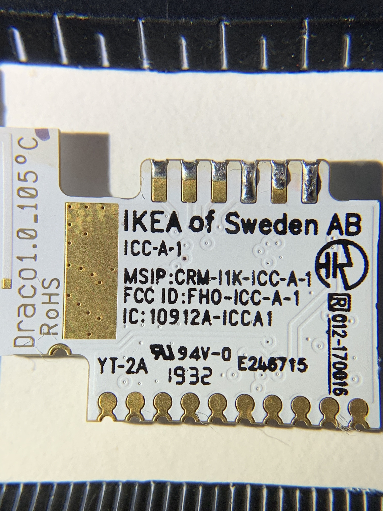
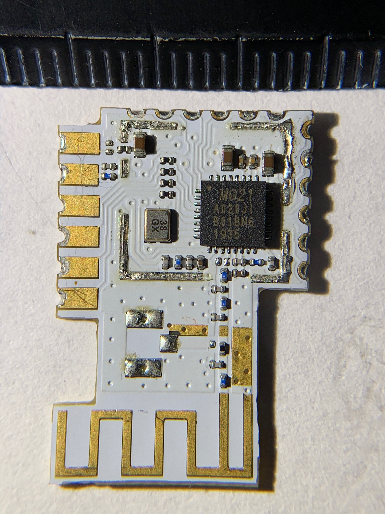
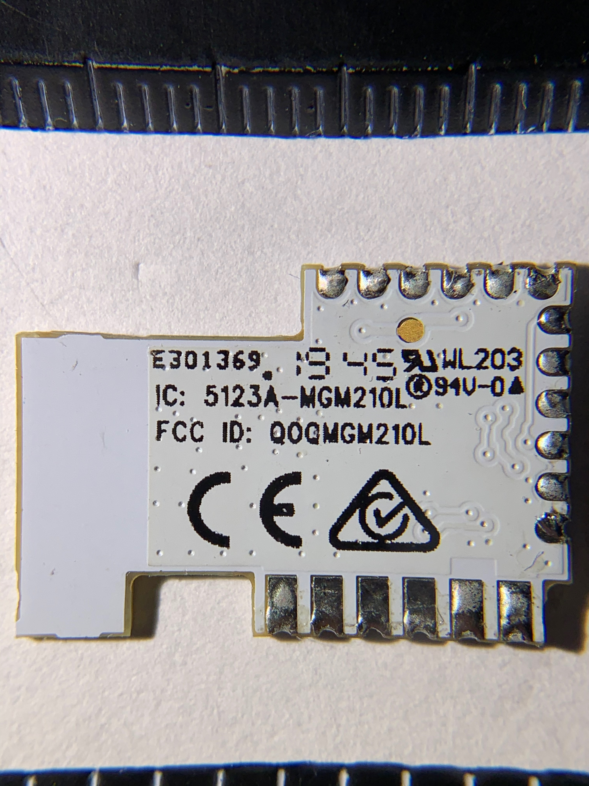

# Modules

* [Types of modules](#types-of-modules)
* [ICC-1 and ICC-A-1](#icc-1-and-icc-a-1)
  * [Components](#components)
  * [Pinout](#pinout)
  * [JTAG](#jtag)
  * [Pictures](#pictures)
* [MGM210L](#mgm210l)
  * [Components](#components-1)
  * [Pinout](#pinout-1)
  * [Flashing using JTAG](#flashing-using-jtag)
  * [Pictures](#pictures-1)

## Types of modules
Many TRÅDFRI products make use of a common board that houses the
microcontroller that is responsible for running the firmware and ZigBee.
This makes it for IKEA much easier to reuse hardware, especially from a
certification perspective.

However, several other TRÅDFRI products have the microcontroller integrated on
the 'core' product board, which makes it possible to design smaller products,
or products with a different form factor. However, they are less usable when
you want to repurpose them. Therefore, they are not part of the sections below.

## ICC-1 and ICC-A-1
The ICC-1 is the first module used by many of the first TRÅDFRI products.

In January 2020 I bought the successor of the cheapest TRÅDFRI LED bulb (the
LED1837R5) and it contains an updated module (ICC-A-1). It looks like some
components have been moved, but all the part numbers look the same. I have
included updated pictures in the [Pictures](#pictures) section.

The only difference I have found (so far), is that PF3 is no longer an output
pin, but used to enable the SPI NOR Flash.

### Components
Both modules use the same energy-efficient microcontroller manufactured by
Silicon Labs. It is an EFR32 Mighty Gecko (Series 1), based around an
ARM Cortex M4 with 256 KiB of flash and 32 KiB of memory. This makes it a very
capable microcontroller.

I have been able to identify the following parts:

* Microcontroller: [EFR32MG1P132F256GM32](https://www.silabs.com/wireless/zigbee/efr32mg1-series-1-socs/device.efr32mg1p132f256gm32)
* 2 Mbit SPI NOR Flash: [IS25LQ020B](http://www.issi.com/WW/pdf/25LQ025B-512B-010B-020B-040B.pdf)
* Crystal: 38.4 MHz

I am very certain that the SPI NOR Flash component is correct. The original
firmware contains strings that refer to the exact part number. However, it also
contains references to other SPI flash components, so your module may contain
another one. The JEDEC ID it responds with is `9d 40 12`.

### Pinout
The pinout of both modules is very similar.

[Marco van Nieuwenhoven](https://diystuff.nl/tradfri/tradfri-zigbee-light-link-module/)
has provided a very detailed teardown of the ICC-1 module. He traced most of
the copper traces and created a schematics on his website.

### JTAG
To connect to an external JTAG/SWD debugger, connect as follows:

* PF0 -> SWCLK
* PF1 -> SWDIO
* PF2 -> SWO
* RESETn -> RESETn
* GND -> GND
* VCC -> VCC (3V3)

The first ICC-1 modules I salvaged, was part of a light bulb. I could leave it
in-place for flashing, as long as I provided my own power supply by hooking it
up to the VCC line directly (NEVER flash a module that is connected to live
power).

[OpenOCD](https://github.com/sysprogs/openocd/blob/master/tcl/target/efm32.cfg)
and [J-Link](https://wiki.segger.com/EFM32) are two popular debuggers that can
be used for flashing and debugging.

### Pictures
I have extracted modules from the LED1650R5 (ICC-1) and the LED1837R5 (ICC-A-1).

Front of two TRÅDFRI modules:

Back of two TRÅDFRI modules:

## MGM210L
Another module variant was identified by @CableCatDK in [issue 39](https://github.com/basilfx/TRADFRI-Hacking/issues/39).
This module seems to be an off-the-shelve module not specifically designed for
IKEA TRÅDFRI.

### Components
An energy-efficient microcontroller manufactured by Silicon Labs is used on
this board. It is an EFR32 Mighty Gecko (Series 2), based around an
ARM Cortex M33 with 1024 KiB of flash and 96 KiB of memory.

* Microcontroller: [EFR32MG21A010F1024IM32](https://www.silabs.com/wireless/zigbee/efr32mg21-series-2-socs/device.efr32mg21a010f1024im32)
* Crystal: 38.4 MHz

Contrary to the previous generation of modules, this board does not have a
SPI NOR flash chip.

The PCB has room for an U.FL external antenna connector.

### Pinout
A pinout can be in the [user manual](https://www.silabs.com/documents/public/data-sheets/mgm210l-datasheet.pdf).

### Flashing using JTAG
To connect to an external JTAG/SWD debugger, connect as follows:

* PA1 -> SWCLK
* PA2 -> SWDIO
* PA3 -> SWO
* RESETn -> RESETn
* GND -> GND
* VCC -> VCC (3V3)

Support for the EFR32MG21 (and Series 2 in general) is limited. There exists a
separate [fork](https://github.com/knieriem/openocd-efm32-series2) for OpenOCD.
J-Link offers support, but requires more-expensive hardware to get started.

### Pictures
Front the TRÅDFRI module:

Back of the TRÅDFRI module:

