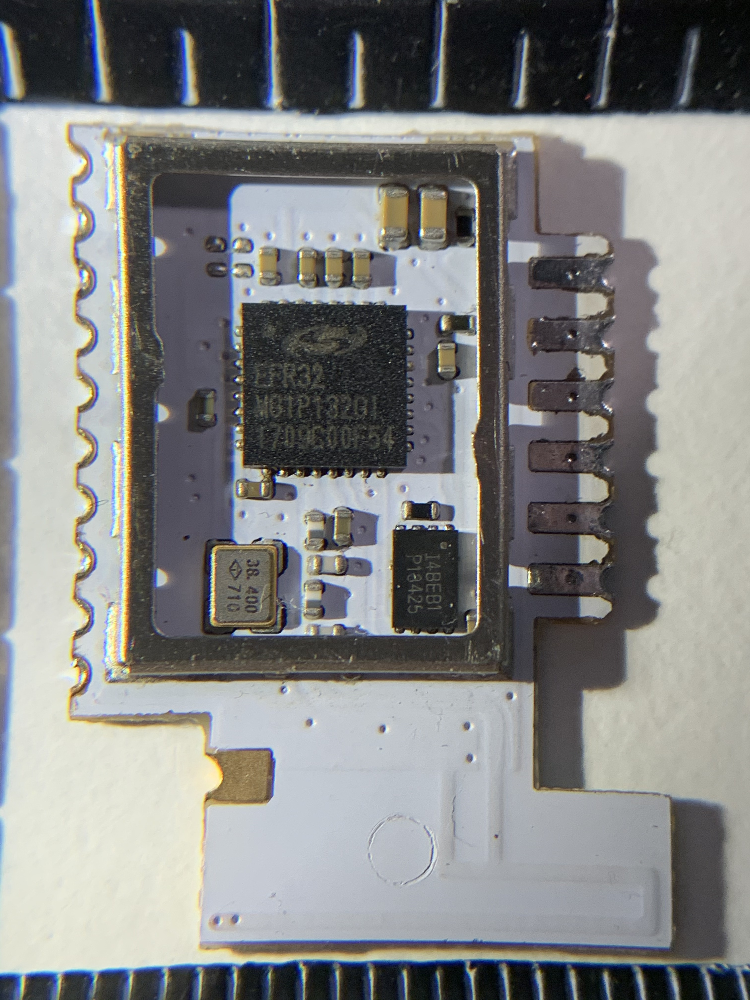
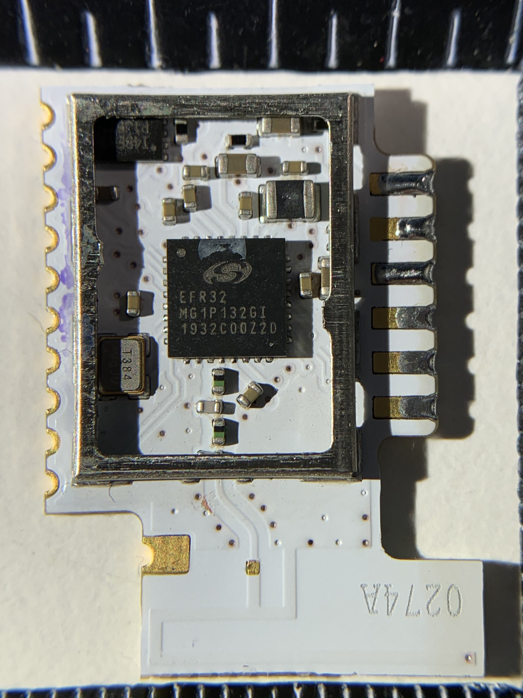

# Hacking IKEA TRÅDFRI

  * [Introduction](#introduction)
  * [TRÅDFRI modules](#trådfri-modules)
  * [Product teardowns](#product-teardowns)
  * [Firmware hacking](#firmware-hacking)
  * [Other hacks](#other-hacks)
    * [EZSP Zigbee coordinator](#ezsp-zigbee-coordinator)
    * [Zigbee router](#zigbee-router)
    * [FLOALT brightness hack](#floalt-brightness-hack)
    * [Shortcut button "no double press" hack](#shortcut-button-no-double-press-hack)
    * [DOOM](#doom)
  * [Sources](#sources)
  * [License](#license)
  * [Safety](#safety)
  * [Disclaimer](#disclaimer)

## Introduction
The [IKEA TRÅDFRI](http://www.ikea.com/us/en/catalog/categories/departments/lighting/36812/)
family of products provide you with several home automation solutions that
interconnect using [Zigbee Light Link](http://www.zigbee.org/zigbee-for-developers/applicationstandards/zigbee-light-link/).
While the line-up initially only included lighting products, it includes power
switches and wireless window blinds as well.

Many of the TRÅDFRI are quite simple. For instance, if we take a simple light
bulb, it contains:

* Power supply
* LED driver
* IKEA TRÅDFRI module

The IKEA TRÅDFRI module is used in many of their products, and is actually
a small piece of circuit board with a few GPIO pins exposed. These pins are
then used to control the LED driver.

The goal of this project is to provide information about the IKEA TRÅDFRI
modules and products, so you can start hacking them. For example:

* Take apart a light bulb, and use the module board, to control your own
  lighting solutions.
* Create custom boards for wall-mounted switches based on their dimmer buttons.
* Patch the firmware to dimming capabilies.
* Repurposing the modules by writing your own firmware.

To find relevant products, I have compiled a list of IKEA TRÅDFRI products in
[PRODUCTS.md](PRODUCTS.md). A teardown of has also been provided for some
products.

## TRÅDFRI modules
So far, a few variations of the TRÅDFRI modules have been identified. They are
all using microcontrollers manufactured by Silicon Labs. The modules that have
been identified are:

* ICC-1
* ICC-A-1
* MGM210L

Some other products, such as the line-up of remote controls, have a dedicated
circuit board that integrate a microcontroller directly (i.e. no separate
module board).

More details and pictures on these modules can be found in
[MODULES.md](MODULES.md).

## Product teardowns
Be sure to check out the [PRODUCTS.md](PRODUCTS.md) on more details on products
that have been reversed-engineered. There are product teardown photos,
schematics, firmware dumps, firmware analysis and more.

If you have any products not in the list, please contribute! If you have any
teardown photos, firmware files or other information, I'd like to add it to the
list.

## Firmware hacking
The TRÅDFRI products use an ARM Cortex M-series microcontroller. There are
plenty of tools for these types of microcontrollers to get started on reversing
firmware files and write your own firmwares.

* Find dumps of firmware files in the OTA [folder](contrib/firmwares/ikea-ota).
* Checkout the [RIOT-OS](contrib/firmwares/riot-os) folder for more information
  on custom firmware development. You can use this as a starting point.
* Reference information on dumping firmware images [here](docs/firmware_dumping/README.md).
* Learn how to inspect the firmware for reverse-enginering in [this](docs/firmware_reversing)
  folder.
* Build a [development board](contrib/pcbs/devboard) for easy access to a
  TRÅDFRI module's pins.

## Other hacks
Some people have came up with alternative uses for the TRÅDFRI modules. Here
are a few:

### EZSP Zigbee coordinator
It is possible to load the Silicon Labs EmberZNet Zigbee coordinator firmware
on an ICC-1 or ICC-A-1. This allows you to use the module to set-up your own
Zigbee network.

MattWestb has provided a guide and firmware [here](https://github.com/MattWestb/IKEA-TRADFRI-ICC-A-1-Module).

### Zigbee router
Several users have [modified](https://community.home-assistant.io/t/sonoff-zbbridge-sonoff-zigbee-bridge-from-itead/187346/88)
the TRÅDFRI routers to improve the performance, by adding an external antenna.

This applies to the ICC-A-1 modules only, but it should be very interesting
if a the TRÅDFRI routers will use the newer MGM210L modules, because they offer
a solder pad for an external antenna.

### FLOALT brightness hack
[zw](https://github.com/zw) has patched the firmware of his FLOALT LED panel to
have an improved range of brightness levels. A guide to perform the firmware
patch has been contributed [here](https://github.com/zw/TRADFRI-Hacking/tree/master/hacks/L1527).

### Shortcut button "no double press" hack
Simon has [patched](https://github.com/nomis/ikea-tradfri-e1812) the firmware
of the E1812 shortcut button to disable the double press feature, getting rid
of the 400ms delay on single presses.

### DOOM
A version of DOOM was port to the IKEA TRÅDFRI MGM210L modules, including a
custom contrller. The project is documented [here](https://next-hack.com/index.php/2021/06/12/lets-port-doom-to-an-ikea-tradfri-lamp/)
and the source code can be found [here](https://github.com/next-hack/MG21DOOM).

## Sources
I have gathered some information from the following sources:

* [IKEA TRÅDFRI hacking](https://tradfri.blogspot.nl)
* [TRÅDFRI: ESP8266-Lampen-Gateway](https://www.heise.de/make/artikel/Ikea-Tradfri-Anleitung-fuer-ein-ESP8266-Lampen-Gateway-3598411.html)
* [TRÅDFRI Zigbee Light Link module](https://diystuff.nl/tradfri/tradfri-zigbee-light-link-module)
* [TRÅDFRI Wall switch](https://wiki.permejdal.dk/TR%C3%85DFRI_wall_switch)

## License
See the [LICENSE.md](LICENSE.md) file (CC-BY-4.0).

## Safety
Some TRÅDFRI products are mains powered. If you don't know what that means, then
stop right now. Please read [this](docs/working_safely) for more information on
working safely on mains-connected devices.

## Disclaimer
This page and its content is not affiliated with IKEA of Sweden AB.

The purpose of this project is to learn and improve using reverse engineering
techniques. Use this information on your own risk. You will void your warranty.
