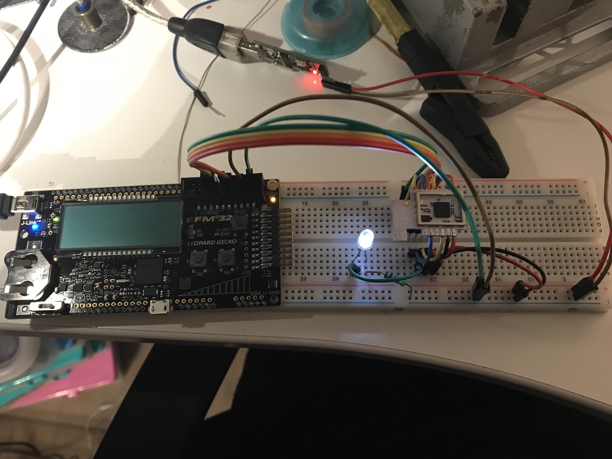

# Working safely

## Introduction
If you plan to work on a mains-powered device, and leave the board in-place,
you must take extra precautions for working safely.

* Disconnect the product from mains voltage whenever you are going to tear it
  apart. Be aware that some product can still be energized after some.
* Work in a clean and tidy environment. You won't be the first to run all
  kinds of extension cords on your desk, then trip over it.
* Never connect external devices (e.g. debugger or serial adapter) to a mains
  powered product that is plugged in. Due to different voltage levels, you
  could destroy your light debugger (and computer) easily.

If you want to connect an external device, ensure that it is properly isolated
(e.g. using a optocoupler). I have designed a board that you could use to
isolate UART signals. You can find it [here](../../contrib/pcbs/isolator).

Further more, keep in mind:

* It is safer to provide your own power supply. This is usually 3.3 volts for
  the modules. Be sure that your power supply is strong enough, because it
  might power more than just the modules.

## Test setup
My setup (the small board is a UART isolator):

My safer setup, including debugger. Instead of controlling the actual LED, I
simply attached an LED to the module I desoldered from a light bulb.

